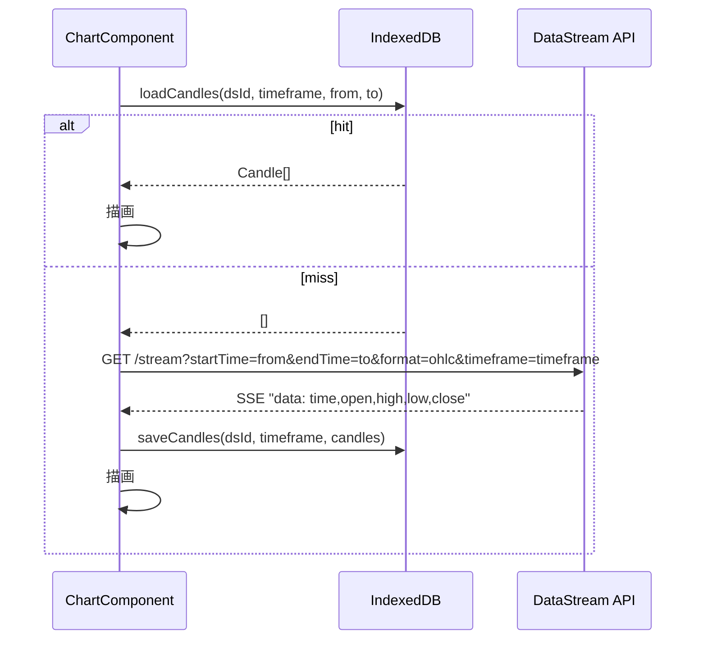

# IndexedDB とバックエンドのデータフロー

以下はチャート表示時におけるフロントエンド IndexedDB とバックエンド API の連携を、時間に着目して表したものです。

- `from` と `to` は ISO 文字列で指定され、IndexedDB では `time` (Unix ミリ秒) をキーに範囲検索します。
- API は `Server-Sent Events` 形式で OHLC データを返し、クライアントは受信後 IndexedDB に保存します。
- 再表示時は同一 `dataSourceId` と `timeframe` で `from` - `to` の範囲に一致するデータがあればそれを再利用します。
